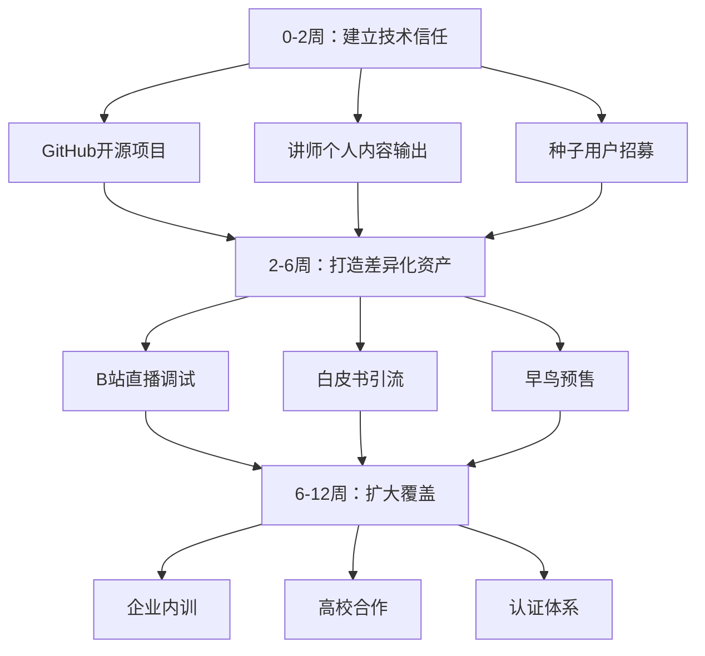

# 道生AI Agent实战训练营营销策略分析报告

## 1. 产品与市场机会关系

### 1.1 市场机会窗口
中国大陆AI Agent市场正处于爆发增长期：2025年中国AI Agent行业市场规模达182.34亿元，同比增长78.03%，预计2023-2027年复合增长率约120%。企业级Agent应用市场2025年已达232亿元，Gartner预测40%的企业应用将在2026年嵌入Agent能力。**但人才供给严重滞后**——市面多数培训停留在“调API、跑Demo”层面，真正具备工程化交付能力的开发者极度稀缺。

### 1.2 产品定位填补的空白
现有培训市场存在明显的**工程化能力断层**：
- 低价课程（如图灵199元9周营）注重广度但深度有限，学员学完仍无法独立完成生产级Agent开发
- 高价课程（如极客时间3000-5000元）偏重理论或平台绑定，缺乏从零手写的底层调试训练
- 免费资源（GitHub教程、B站碎片）缺乏系统化和持续指导

**道生AI训练营的核心机会**：填补“从零手写 + 代码调试 + 工程化交付”的中档价位市场空白（500-2500元区间），以**真正的代码实战能力**而非API演示作为价值锚点。

### 1.3 产品与市场匹配度
| 市场真实需求 | 道生AI课程设计 | 匹配度 |
|------------|--------------|--------|
| 能写出可部署的Agent，而非Demo | 从零手写，完整项目交付 | ✅ 高度匹配 |
| 遇到Bug能独立调试 | 系统化代码调试教学（失败案例+错误复现） | ✅ 高度匹配 |
| 理解工作流设计模式（ReAct/Plan-and-Execute） | Agent工作流设计模块 | ✅ 匹配 |
| 掌握评估与安全护栏 | LLM as Judge、成本控制、安全边界 | ✅ 匹配 |
| 有可展示的简历项目 | 多个实战项目+代码仓库 | ✅ 匹配 |

## 2. 目标客户与购买动机

### 2.1 目标客户分层画像

| 客户分层 | 典型特征 | 核心痛点 | 购买动机 |
|---------|---------|---------|---------|
| **A层：在职开发者**（1-5年经验，前端/后端/全栈） | 有编程基础，正面临AI冲击，寻求转型 | 学了大量AI课仍写不出能用的Agent；公司要求落地Agent但无从下手 | 获取可迁移的工程化能力，保住职业竞争力，甚至加薪晋升 |
| **B层：计算机专业学生**（大三至研三） | 面临就业，希望简历脱颖而出 | 高校课程偏学术，缺少实战项目；面试被问Agent开发经历 | 获得可量化的项目成果（GitHub仓库+作品集），提高校招通过率 |
| **C层：职业转型者**（非CS背景但有逻辑思维） | 希望进入AI领域，接受系统性训练 | 碎片化学习效率低，缺乏从零开始的路径 | 系统化入门，通过实战证明自己有能力转型 |
| **D层：技术管理者/架构师** | 需要评估Agent技术选型，带队落地 | 团队缺乏Agent开发经验，难以评估方案优劣 | 了解全链路工程化难点，做出正确技术决策 |

### 2.2 购买动机排序（按优先级）
1. **职场避险**：传统开发岗位被AI替代的恐慌 → 需要学会利用AI Agent增强自身竞争力
2. **薪资提升**：Agent开发工程师薪资溢价（较普通开发高出30-50%）
3. **项目背书**：面试时能展示完整的Agent代码仓库和设计文档
4. **体系化学习**：避免碎片化浪费时间，一次学透
5. **圈子资源**：进入高质量开发者社群，获得持续技术支持和内推机会

## 3. 核心价值与主要卖点

### 3.1 核心价值主张
**“不做API调包侠，真正能交付生产级Agent”**

- 不是拆解LangChain文档，而是手写Agent核心逻辑
- 不是跑通Demo就结束，而是完成从设计、调试、评估到部署的全链路
- 不只是听课，而是获得一套可复用的Agent开发框架和工程规范

### 3.2 主要卖点分解

| 卖点 | 具体内容 | 对应痛点 |
|------|---------|---------|
| **从零手写（Hands-on from Scratch）** | 不依赖高级框架封装，逐行代码实现Agent核心组件（工具调用、记忆管理、路由决策） | 学完框架却不会自己写 |
| **代码调试全记录** | 每节课包含“常见错误复现+逐步调试+优化思路”，不再是完美演示 | 遇到Bug无从下手 |
| **Agent工作流设计模式** | 教授ReAct、Plan-and-Execute、Multi-Agent协作等模式的选择与应用 | 不知道如何设计复杂Agent |
| **工程化交付标准** | 包含CI/CD、性能监控、成本控制、安全测试、LLM as Judge评估体系 | Demo能跑但无法上线 |
| **3个可写入简历的实战项目** | 从客服Agent到自动化工作流再到多Agent协作系统，每个项目提供GitHub代码+设计文档 | 简历里没干货 |
| **终身社群答疑+1对1代码Review** | 课程结束后持续支持，讲师每周直播解答 | 学完没人问 |

## 4. 竞争差异与购买阻力

### 4.1 竞争差异分析

| 对比维度 | 图灵实战营（199元） | 极客时间训练营（3000-5000元） | **道生AI（目标定位）** |
|---------|-------------------|--------------------------|----------------------|
| 价格 | 极低，流量导向 | 中高，品牌溢价 | **中档，价值导向**（预估800-2000元） |
| 深度 | 9周覆盖广，但每块深度有限 | 理论体系完整，但偏平台/产品视角 | **最深的工程化交付**，代码调试是核心 |
| 实战 | 每周围绕一个课题，偏Demo级 | 有项目作业，但指导密度有限 | **从零手写全流程**，手把手调试 |
| 差异化 | 价格+出书机会 | 品牌+企业内推 | **“能写的Agent” vs “能用的Agent”** |
| 售后 | 社群仅课程期间 | 社群+专属助教 | **终身社群+代码Review** |

**核心差异化壁垒**：代码调试教学（所有竞品都回避失败案例） + 工程化交付标准（竞品止步于Demo）

### 4.2 购买阻力与化解策略

| 购买阻力 | 强度 | 化解策略 |
|---------|------|---------|
| **品牌认知度为零**（“道生AI”在公开渠道查不到） | 🔴 极高 | ① 提供讲师公开履历/技术文章（GitHub、知乎、CSDN）；② 开放免费试听课（1小时代码调试直播）；③ 与知名社区（如图灵、极客时间？）联名合作 |
| **价格低于199元高性价比竞品** | 🔴 高 | ① 用对比图展示深度差异（工程化内容价格对比）；② 提供“30天无条件退款”降低决策风险；③ 早鸟价499元限100人，制造稀缺 |
| **技术迭代太快，担心课程过时** | 🟡 中 | ① 承诺一年内课程内容免费更新；② 以“底层原理+通用模式”为主，减少对单一框架的依赖；③ 持续跟踪MCP、A2A等新协议 |
| **对“割韭菜”课程普遍不信任** | 🟡 中 | ① 公开课程代码质量（GitHub Star激励）；② 邀请往期学员真实评价；③ 与高校合作试点背书 |
| **时间承诺成本高**（预计10周+） | 🟡 中 | ① 提供录播+直播回放；② 课程设计成“周末突击+工作日练习”模式；③ 完成率奖励（完成即返还部分学费） |

## 5. 品牌语气与核心沟通原则

### 5.1 品牌语气定位
**专业 · 务实 · 不画饼 · 工程师对工程师**

- **专业**：每节课提供可复现的代码+文档，不夸大效果
- **务实**：坦诚说明Agent的当前局限（幻觉、成本、安全），不吹嘘万能
- **不画饼**：课程承诺的就是学完后能做的事，可量化可验证
- **工程师对工程师**：使用精准技术术语，但辅以清晰解释；尊重学员的编程基础

### 5.2 沟通语调示例

| 场景 | 表述方式 | 语气 |
|-----|---------|------|
| 课程介绍 | “我们不教怎么调API，教的是当API不好用时，怎么自己修。” | 直率、自信 |
| 对比竞品 | “别人9周带你跑通Demo，我们用10周让你能独立debug。” | 有依据的差异化 |
| 社群互动 | “你发代码，我给建议，而不是一句‘多试几次’。” | 支持性、行动导向 |
| 处理质疑 | “是的，我们品牌还新，但我们的课程代码已经在GitHub被Fork了XX次。” | 用事实回应 |
| 价格解释 | “199元的课让你知道Agent是什么，我们的课让你能靠它找工作。” | 价值对等 |

## 6. 当前最适合优先发力的方向

### 6.1 紧急行动（0-2周）
**建立技术信任**（品牌从零起步，必须先让人看到真本事）
- **GitHub开源**：发布一个完整的“从零手写Agent”迷你项目（约500行代码），包含详细文档和调试过程，打上#AI-Agent #HandsOn 标签
- **讲师个人品牌**：在知乎/B站/CSDN发布“代码调试系列”文章（如：<重构一个失败的Agent：你的记忆模块为什么溢出？>），每篇包含真实案例+复现+修复步骤
- **邀请首批种子用户**：通过技术社群（如V2EX、即刻、Reddit中文版）招募50名内测用户，免费参与并反馈，换取真实评价和转发

### 6.2 短期重点（2-6周）
**打造差异化内容资产**
- **B站直播“代码调试之夜”**：每周一次，现场随机挑选Amazing Agent bug（从Kaggle/论坛找），完整演示调试过程，吸引开发者关注
- **建立“工程化交付标准”白皮书**：五页PDF，列出生产级Agent必备的12个检查点（可量化），免费领取需加微信，沉淀私域流量
- **启动早鸟预售**：限100个名额，价格799元（原价1499元），并承诺“学完不满意全额退款”，同时赠送白皮书+调试模板

### 6.3 中期布局（6-12周）
**扩大覆盖并建立生态**
- **企业内训合作**：针对中小企业（Agent落地需求迫切），推出企业版课程（3天线下+1个月线上），定价8000元/人起
- **高校合作**：联系二线院校计算机系，以“工程化实战”为卖点开设选修课或工作坊，获取首届学员背书
- **建立“Agent工程化认证”**：完成全部课程并通过代码评审的学员，可获得证书+内推信，形成闭环

### 6.4 优先级排序图

**最关键的第一步**：立即在GitHub发布一个高质量的“从零手写Mini Agent”项目，用代码证明实力。这是零品牌信任下最有效的破冰方式。

## 7. 购买路径与转化漏斗设计

| 阶段 | 动作 | 交付物 | 指标 |
|------|------|--------|------|
| 认知 | 知乎/B站/CSDN深度技术文章 | 单篇文章阅读量 > 5000 | 曝光量 |
| 兴趣 | 白皮书/调试模板免费领取（需加微信） | 添加好友数 > 200人/周 | 私域沉淀 |
| 考虑 | 参与B站直播或免费试听课（1小时） | 试听报名率 > 30% | 兴趣转化 |
| 购买 | 早鸟预售（限时优惠+30天退款保证） | 首批100个名额售罄 | 收入+口碑启动 |
| 留存 | 社群代码Review+每周答疑 | NPS > 60 | 复购/推荐 |
| 传播 | 学员结业项目公开+GitHub加星 | 每个学员带来至少1个推荐 | 增长飞轮 |

**转化优化点**：
- 试听课保留20%核心干货（如调试一个真实Bug），结束时留悬念：“完整调试指南在训练营第三天解密”
- 优惠释放：“前50名额外赠送1对1简历优化指导”制造紧迫感

---

## 8. 关键KPI设计（3个月目标）

| 指标 | 目标值 | 测量方式 |
|------|-------|---------|
| 品牌搜索指数（百度/微信） | "道生AI"月搜索量 > 1000 | 百度指数/微信指数 |
| GitHub Star | 开源项目 > 200 Star | GitHub |
| 私域用户数 | 微信好友/群成员 > 2000人 | 手动统计 |
| 早鸟购买量 | 100个名额售罄 | 后台订单 |
| 课程完成率（完课率） | 首期学员 > 70% | 作业提交+视频观看时长 |
| NPS | ≥ 60 | 课程结束问卷调查 |
| 学员作品GitHub Star | 平均每个学员项目 ≥ 5 Star | GitHub API |

---

## 9. 风险对冲与品牌注意事项

- **品牌名称确认**：若“道生AI”无法注册或存在混淆（如与腾讯汤道生关联），建议改为**“零号Agent”**或**“AgentBuild实验室”**等更清晰易记的名称。
- **避免虚假宣传**：所有“从零手写”承诺必须真实（可录制完整开发过程），否则将毁灭性影响口碑。
- **师资背书**：强烈建议公开讲师真实姓名+技术背景+过往项目，甚至可以提供开源贡献记录。这是消除品牌冷启动疑虑的唯一方法。
- **价格锚定**：切勿直接与199元图灵活跃价格对比——应转为“价值对比”：列出图灵营不包含但道生包含的模块（调试课、1对1Review、终身答疑），用差异证明溢价合理。

---

**总结**：道生AI Agent实战训练营的市场机会坚实（工程化能力缺口+中档价格带空白），但品牌认知是最大障碍。**当前压倒一切的任务是用真实的代码能力建立信任**，通过开源、直播、技术文章三位一体打造“真刀真枪”的工程师社区形象。一旦获得首批100名学员的口碑背书，后续增长将进入正循环。